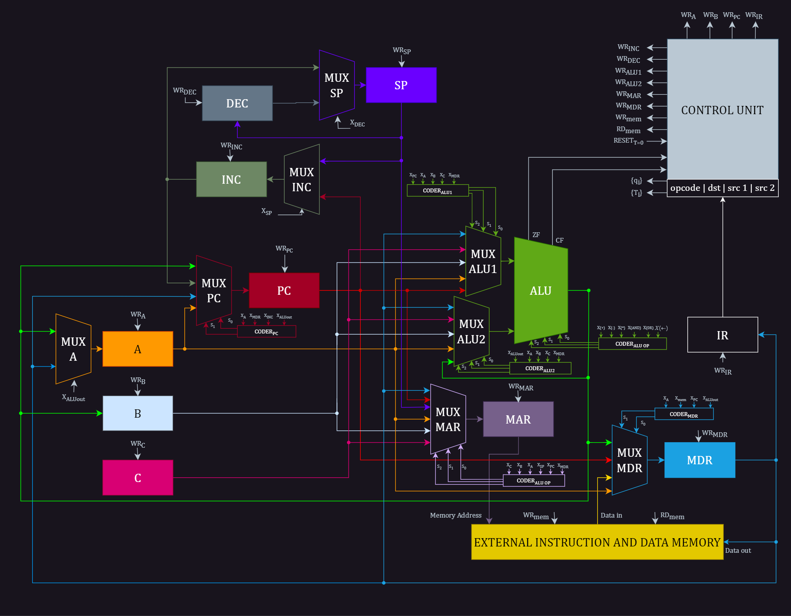

# Datapath for Simple CPU

[Link to Full Resolution Datapath Diagram](./Datapath.drawio.pdf)

## Core Components

* **Registers (A, B, C):** These are storage units for temporary data within the CPU.
* **Arithmetic Logic Unit (ALU):** The ALU performs mathematical operations (like addition, subtraction) and logical
  operations (like comparisons) on data.
* **Program Counter (PC):** This register stores the memory address of the next instruction to be executed.
* **Memory Address Register (MAR):**  This holds the memory address from which data will be read or written.
* **Memory Data Register (MDR):** This register acts as a buffer, holding the data that has been read from or will be
  written to memory.
* **Instruction Register (IR):** This register holds the currently fetched instruction.
* **Control Unit:** This is the "brain" of the datapath, generating control signals that dictate the operation of all
  the other components.

## Data Flow

1. **Instruction Fetch:**
    - The PC holds the address of the next instruction.
    - This address is sent to the memory via the MAR.
    - The instruction is fetched from memory and stored in the MDR.
    - The MDR contents are then transferred to the IR for decoding.

2. **Instruction Decode:**
    - The control unit interprets the instruction in the IR.
    - It determines the operation to be performed, the source of operands, and the destination for the result.

3. **Operand Fetch:**
    - If the operation requires data from registers, the registers A, B, or C are selected based on the instruction.
    - If data needs to be fetched from memory, the address is calculated and sent to the MAR.
    - The data is fetched from memory and stored in the MDR.

4. **Execute:**
    - The ALU performs the operation specified by the instruction on the fetched operands.
    - The result is stored in a register or written back to memory, depending on the instruction.

5. **Write Back (if applicable):**
    - If the instruction's result is to be stored in a register, it's written back to the appropriate register (A, B, or
      C).
    - If the result is to be stored in memory, the address is sent to the MAR and the data is written to the MDR.

## Additional Components

* **Multiplexers (MUX):** These components select one of several inputs to pass through as output. They are used to
  control the flow of data in the datapath based on control signals.
* **Decoders:** These components transform the instruction into signals that control the operation of other components
  in the datapath.
* **Incrementers (INC):** These units are used to increment the PC, ensuring that the CPU fetches the next instruction
  in sequence.

## Key Points

* This datapath has a limited instruction set due to the small number of registers and the relatively simple ALU.
* It is designed for educational and illustrative purposes rather than representing a real-world, high-performance CPU.